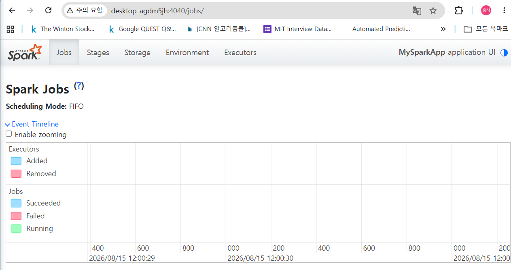
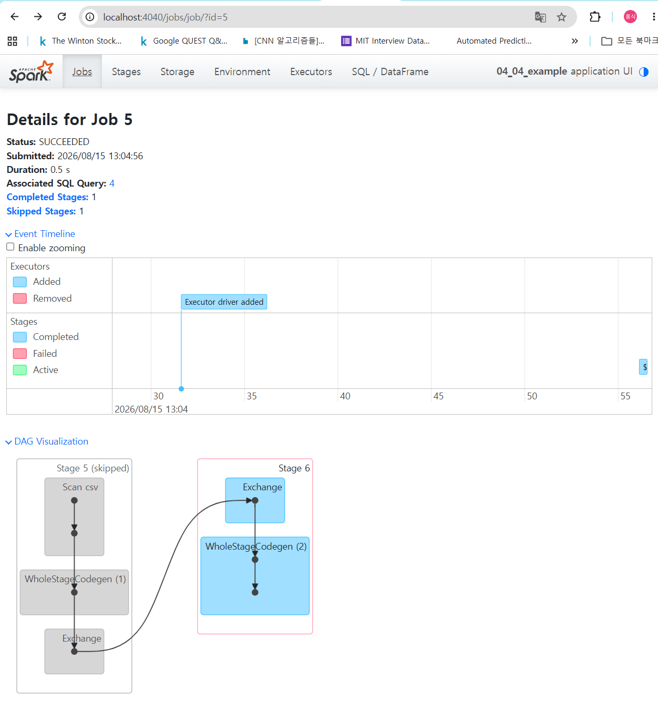
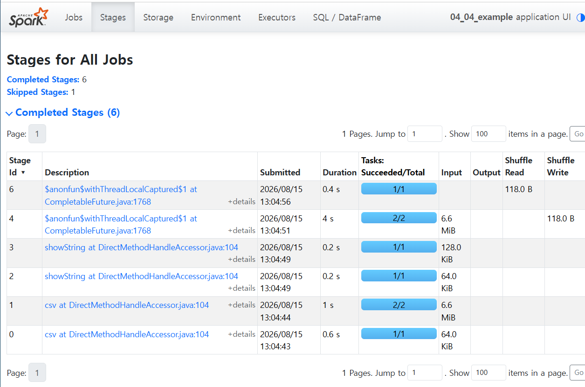
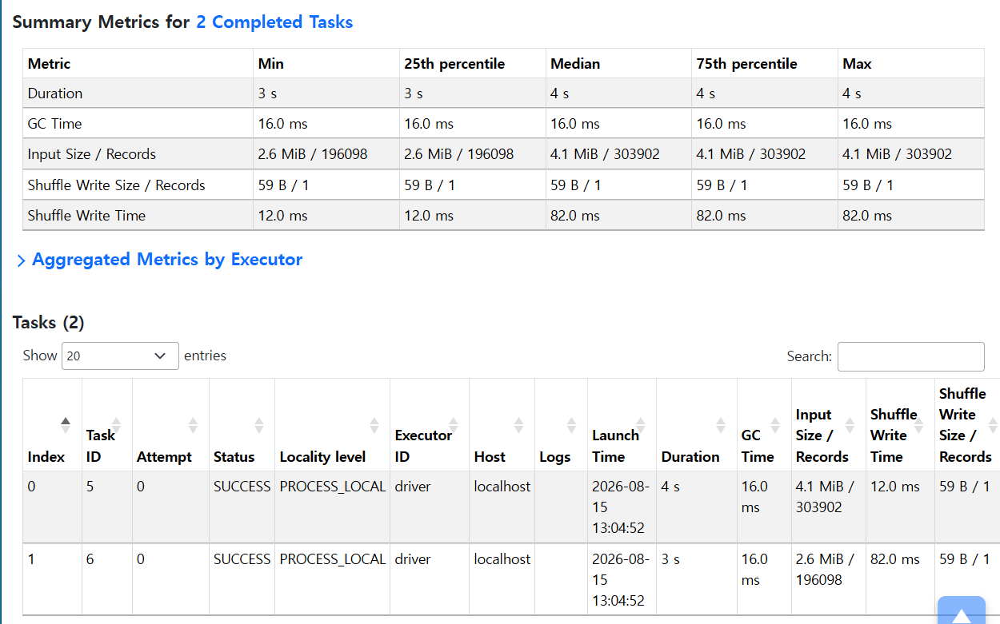
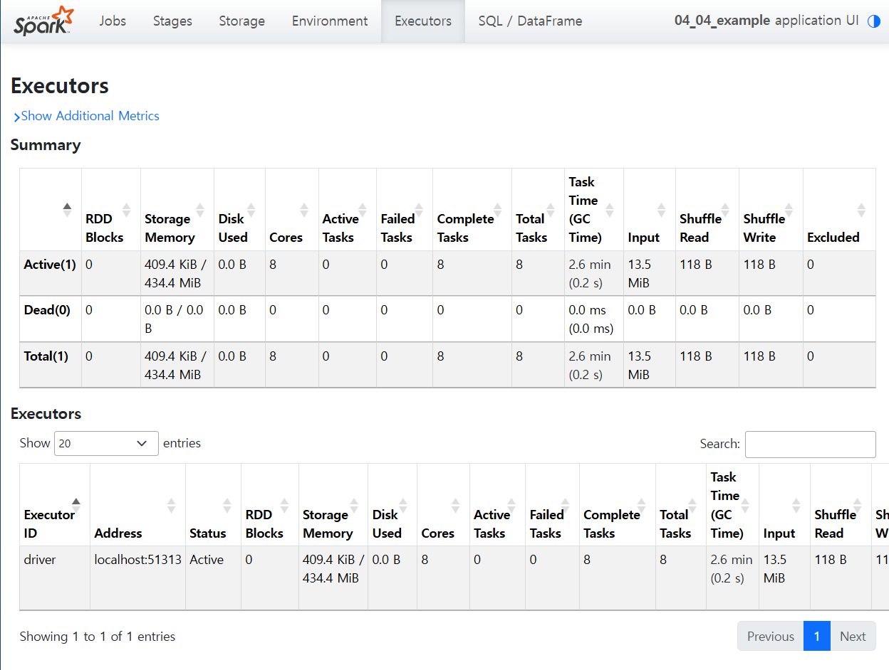

## 목차

* [1. Spark UI 개요](#1-spark-ui-개요)
* [2. Spark UI 에서의 작업](#2-spark-ui-에서의-작업)
  * [2-1. DAG 그래프 확인](#2-1-dag-그래프-확인)
  * [2-2. Stage 분할 확인](#2-2-stage-분할-확인)
  * [2-3. Task 소요 시간 확인](#2-3-task-소요-시간-확인)
  * [2-4. Executor Summary 확인](#2-4-executor-summary-확인)

## 1. Spark UI 개요

Spark UI는 **Spark Job, Stage 등을 점검할 수 있는 UI** 이다.



## 2. Spark UI 에서의 작업

Spark UI 에서는 다음 작업을 할 수 있다.

* [DAG 그래프 확인](#2-1-dag-그래프-확인)
* [Stage 분할 확인](#2-2-stage-분할-확인)
* [Task 소요 시간 확인](#2-3-task-소요-시간-확인)
* [Executor Summary 확인](#2-4-executor-summary-확인)

### 2-1. DAG 그래프 확인

* 각 Job에 대해 아래와 같이 DAG 그래프를 확인할 수 있다.



### 2-2. Stage 분할 확인

* ```Stage``` 메뉴



### 2-3. Task 소요 시간 확인

* 전체 Task의 소요 시간에 대한 통계 (min, max, median 등)
* 각 Task 의 소요 시간 등 상세 정보 확인 가능



### 2-4. Executor Summary 확인

* 각 Executor 별 성공/실패한 task 등 상세 정보 확인 가능


